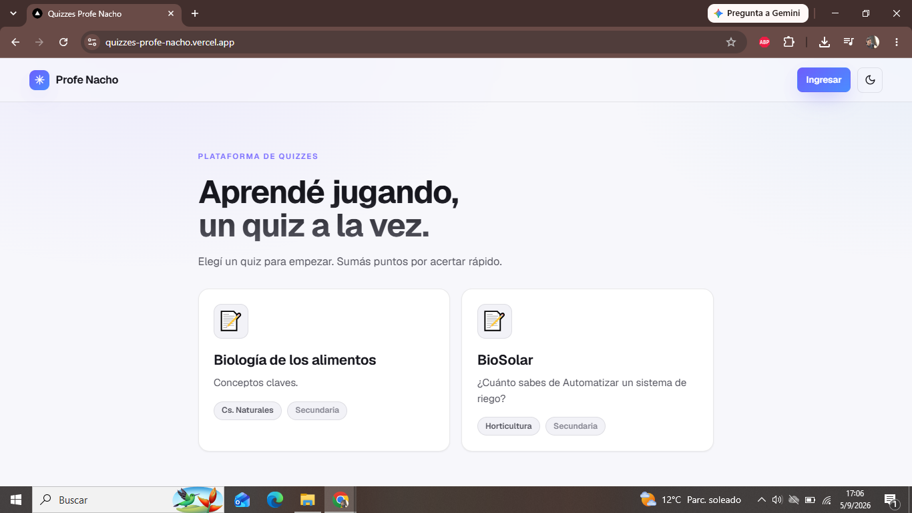
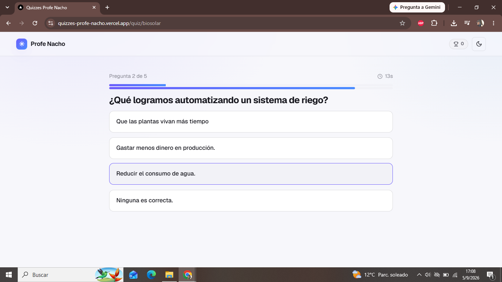
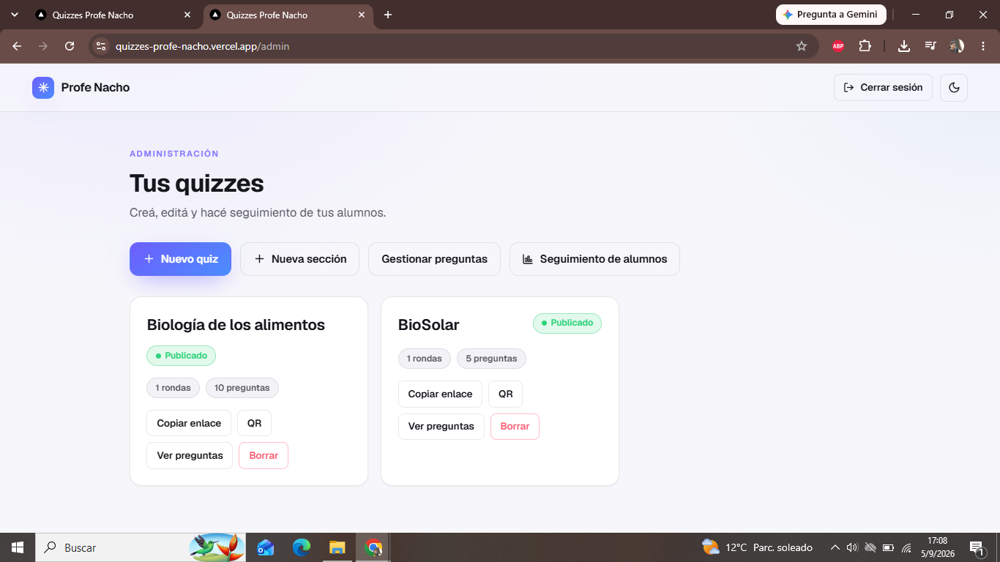
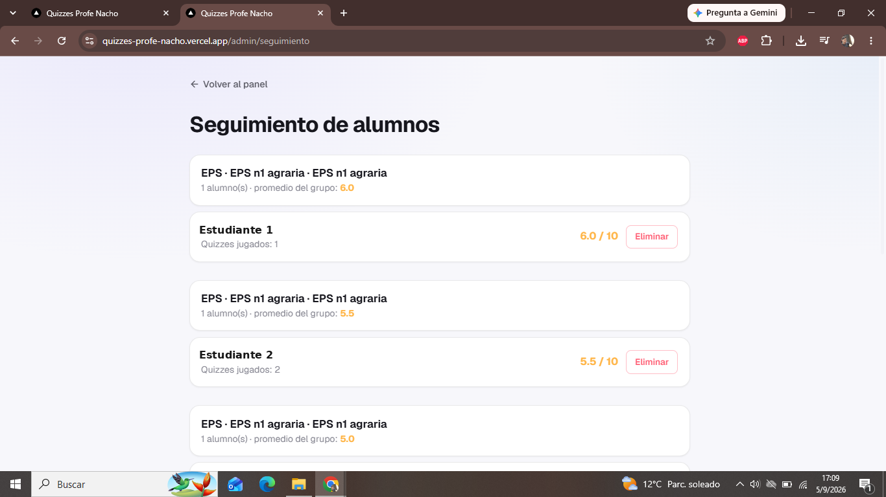
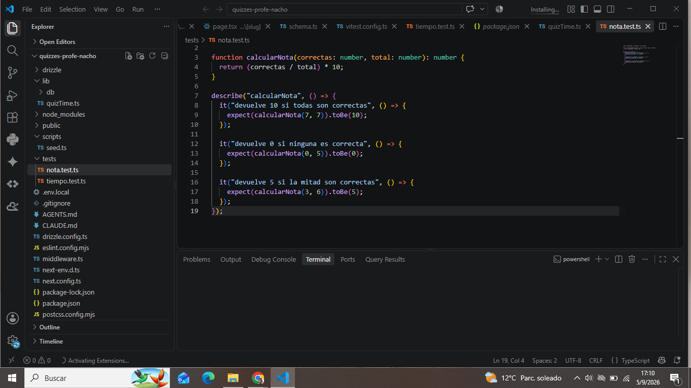

# 🧪 Quizzes Profe Nacho

Plataforma web full-stack de quizzes educativos interactivos. Los estudiantes practican jugando y el docente administra el contenido, hace seguimiento de resultados y comparte los quizzes con un enlace o un código QR.


### 🔗 [Ver la aplicación funcionando →](https://quizzes-profe-nacho.vercel.app/)



---

## El problema que resuelve

Como docente de ciencias naturales necesitaba una forma ágil de que mis estudiantes practicaran y afianzaran conceptos, y de tener un registro real de cómo les iba. Las herramientas que probé eran caras, no permitían usar imágenes en las preguntas (algo clave para química y biología, donde hay que reconocer estructuras, moléculas o esquemas) o no dejaban hacer seguimiento por curso.

Así que la construí. Quizzes Profe Nacho está pensada desde el aula real: un docente carga sus propios quizzes con imágenes, los comparte con un QR impreso en el pizarrón o pegado en la carpeta, y los estudiantes juegan desde el celular. El docente después ve los promedios agrupados por escuela, año y división.

Hoy la uso con contenidos de mis propios proyectos áulicos, como el sistema de riego automatizado BioSolar y la unidad de biología de los alimentos.

## Demo en vivo

**App:** https://quizzes-profe-nacho.vercel.app/

Los quizzes son públicos y se puede entrar sin cuenta para probarlos. El registro es opcional y sirve para que a los estudiantes se les guarden los resultados.

## Funcionalidades

### Para estudiantes



- Acceso a quizzes públicos por enlace directo o código QR.
- Registro y login según modalidad educativa (Secundaria, Secundaria Técnica, EPS, Adulto CENS, FinES y Terciario).
- Preguntas y opciones con imágenes, y explicación al responder cada una.
- Temporizador configurable por pregunta (5, 10, 15, 20, 30 segundos o sin límite).
- Puntaje final en escala de 0 a 10 con el detalle de respuestas correctas.
- Historial de resultados y promedios para quienes tienen cuenta.
- Interfaz responsive y modo oscuro automático.

### Para el administrador (docente)



- Panel de administración protegido con contraseña.
- Alta, edición y baja de quizzes, organizados en secciones o rondas.
- Carga de preguntas con imágenes en el enunciado y en cada opción, incluida la edición de esas imágenes.
- Configuración del tiempo por pregunta.
- Generación y descarga del código QR de cada quiz en PDF, listo para imprimir.
- Panel de seguimiento de alumnos agrupados por modalidad, escuela, año y división, con promedios en escala 0 a 10.



## Stack tecnológico

| Área | Tecnología |
|------|-----------|
| Framework | Next.js 16 (React 19, App Router) |
| Lenguaje | TypeScript |
| Base de datos | SQLite en Turso |
| ORM | Drizzle |
| Almacenamiento de imágenes | Vercel Blob |
| Estilos | Tailwind CSS |
| Hash de contraseñas | bcryptjs |
| Testing | Vitest |
| Generación de QR y PDF | qrcode.react + jsPDF |
| Deploy | Vercel (despliegue continuo desde GitHub) |

## Aspectos técnicos destacados

- **Base de datos relacional con Drizzle ORM sobre Turso**, modelando quizzes, secciones, preguntas, opciones, usuarios y resultados, con consultas tipadas de punta a punta.
- **Contraseñas hasheadas con bcryptjs**, nunca guardadas en texto plano.
- **Carga y gestión de imágenes** en preguntas y opciones usando Vercel Blob, incluida la sustitución de imágenes al editar.
- **Generación de códigos QR descargables en PDF** con qrcode.react y jsPDF, para llevar los quizzes del entorno digital al aula física.
- **Autenticación con distintas modalidades de usuario** y panel de administración protegido.
- **Pruebas unitarias con Vitest** sobre la lógica de cálculo de notas.



## Ejecutar localmente

> Requisitos: Node.js 20 o superior y una cuenta de Turso.

```bash
# 1. Clonar el repositorio
git clone https://github.com/garciahernan25-ui/quizzes-profe-nacho.git
cd quizzes-profe-nacho

# 2. Instalar dependencias
npm install

# 3. Crear el archivo .env.local con las variables de abajo

# 4. Aplicar el esquema a la base de datos
npx drizzle-kit push

# 5. Levantar el servidor de desarrollo
npm run dev
```

La app queda corriendo en `http://localhost:3000`.

### Variables de entorno

Creá un archivo `.env.local` en la raíz con estas variables:

```env
TURSO_DATABASE_URL=
TURSO_AUTH_TOKEN=
BLOB_READ_WRITE_TOKEN=
ADMIN_PASSWORD=
AUTH_SECRET=
```

## Tests

```bash
npx vitest run
```

## Autor

**Hernán Andrés García**
[GitHub](https://github.com/garciahernan25-ui)
